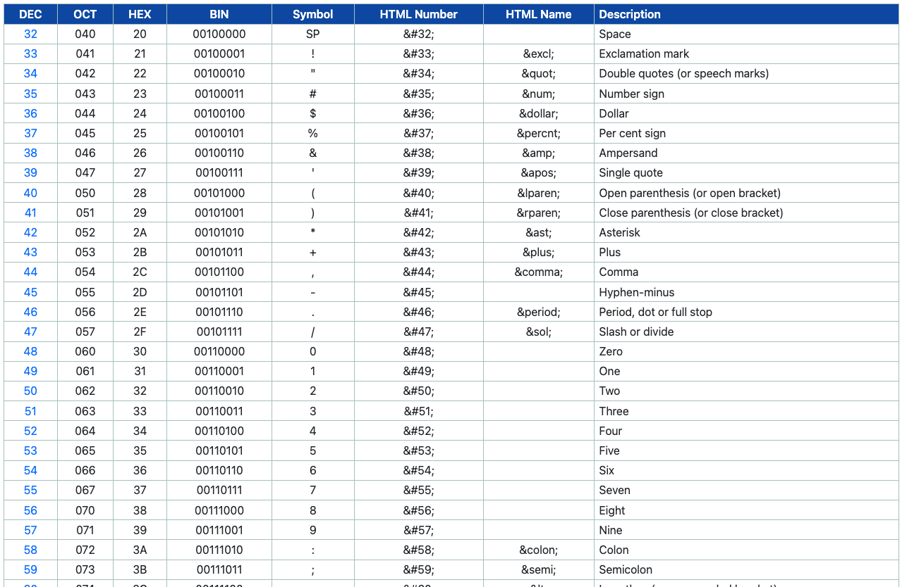
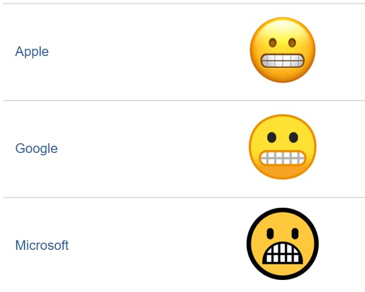
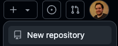
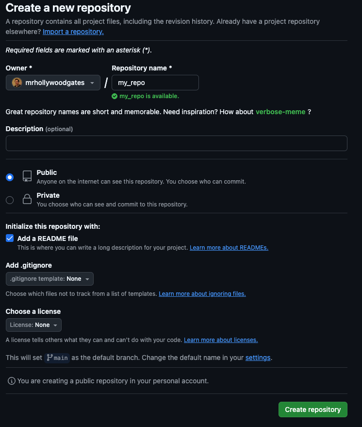
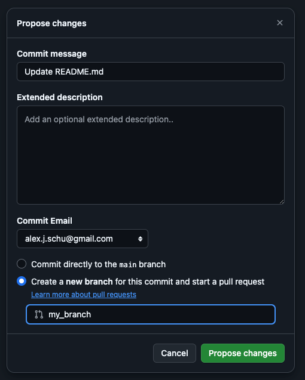
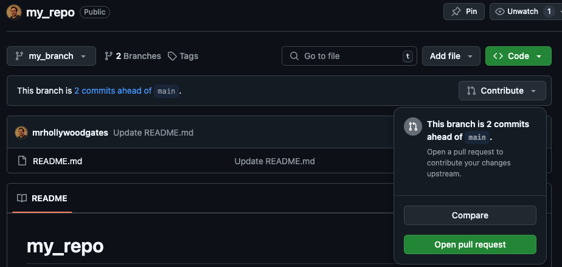
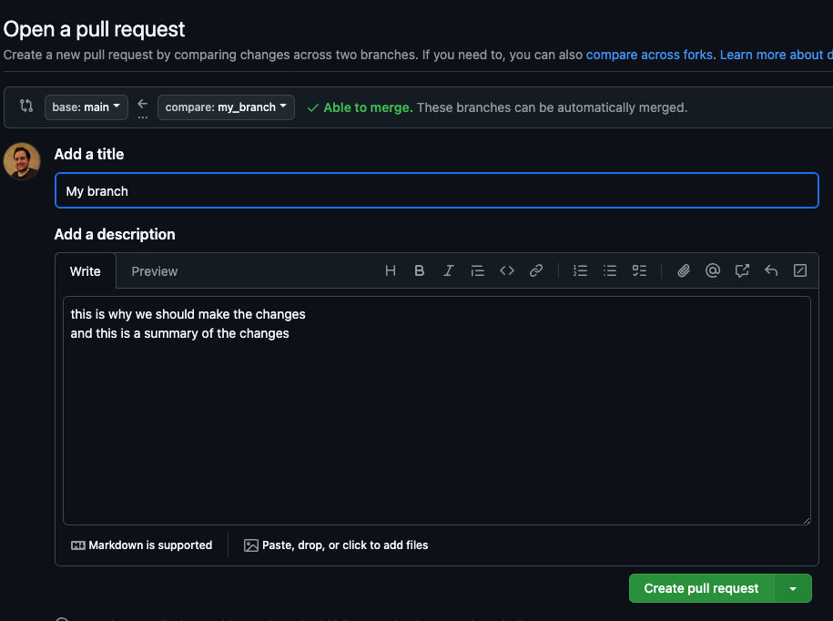

<style>
section {
  font-size: 30px;
}
</style>

# Text As Code
Alex Schumacher
<!-- Or why old computer nerds are angry at emoji -->
---

# Outline
1. Character Encoding
2. Markup Languages
3. Publishing
4. Working With Text as Code

---
<!---  
Computers store data in binary. Each character must be represented by some binary string.
Character encoding lets the computer translate this to something we can read --->

## Character Encoding

- How each letter, symbol, or other piece of text is stored on a computer. 
- 
- Translates binary into human

---

## Definitions

*Character* - The individual symbols or letters - `A` `!` `+` `Ö`

*Binary* - Computer code that represents all characters as `0` or `1` 
            (ex. `A` is `01000001`)

*Encoding* - The translation of characters to binary.

---

## How it works:
<!--- How did we get here? 
Computer scientists long ago had to assign characters to binary numbers. What they chose affected
computer development for generations. 

If you're writing a program, you have to know what kind of characters are going to be used. 
--->


- Someone has to decide what set of binary numbers represent what character, creating a "character set". 

- Every computer program uses this character set to determine what characters to show when you read a file. 


---

## Examples
<!---
ASCII only has 128 possible characters, very simple. Imagine trying to type in another language using ASCII!
UTF-8 has 1,112,064. 
Unicode is a non-profit in California that keeps up with our changing language. 
Over 90% of the internet uses Unicode encoding. 

Ascii start wars: run `nc towel.blinkenlights.nl 23` in terminal
--->

  - ASCII (American Standard Code for Information Interchange)  
  
  - UTF-8 (Unicode Transformation Format – 8)
  
---
<!-- ASCII table - the html name, the BIN relating to binary -->
## Examples



---
<!-- 
Real-world examples: emoji, strictly-defined publishing
Apple/Android/Samsung all show the same emoji code differently 

Understanding what encoding type you’re using can affect what characters 
you can and can’t display, how something is communicated, or why something 
looks differently to one person or another.

Story from work - copying something that uses a different character encoding makes it show up 
differently where you paste it, since all it's "copying" is the binary numbers, and its up to the 
program to interpret what character to show. 
-->
## Examples



---
<!--- 
Now that we know how each letter is stored. What about sentences, paragraphs, more complex things.
You will use this much more often than you'll use character encoding, but you can give specific 
character encoding directives via markup languages. 

I'm not teaching you a specific language tonight, just concepts that you will run into when 
creating online documentation. 

Markdown is the behind-the-scenes way that documents are formatted for print, publication, or web. 
--->

## Markup Languages

- Combines the character encoding and all the other formatting of a document (font, spacing, margins, etc). 
  
- Interpreted by a program to display or print. 
  
---
## Definitions

- Plain Text - text without any formatting directives - the raw characters saved in a file. 
  
- Rich Text - a text file that contains extra information about how the text should be displayed. 

---
<!--- 
Each character here, including the spaces, commas, etc are all simply stored as characters. Not very exciting. 
--->
## Example

```
Lorem ipsum dolor sit amet, consectetur adipiscing elit, sed do eiusmod tempor incididunt ut labore et dolore magna aliqua
```

---
<!--- 
Here we see how to add formatting. 
--->
## Example

Markup directives add formatting: 
- `abcd` from `` `abcd` `` as surrounded backticks
- *italic* from `*italic*`
- **bold** from `**bold**`
- ~~strikethrough~~ from `~~strikethrough~~`
- > blockquote from `>`
- [source link](https://www.website.com) from `[source link](http://www.website.com)`
- and some fancy emojis :smile: from `:smile:` using words surrounded by colons

---
<!--- 
Languages you may have heard of
--->
## Markup Language Examples

- HTML
- XML
- Markdown
- Wikicode
- reStructured Text

---
<!--- 
VSCode is very common across the industry. 
Notepad is the most basic editor on Windows. 
LaTex is a very academic-focused editing system that 
combines markup and its own formatting for advanced typesetting.
--->
## Text Editors

- Plain text editors: 
  - VSCode
  - Notepad
  - LaTeX
- Rich Text editors (aka, "what you see if what you get")
  - MS Word
  - Google Docs

---
<!--- 
Point out the UTF-8 headers in the XML, as well as in VS Code. 

Talk about work examples - every piece of documentation I've ever
seen or worked on professionally has been stored as some sort of 
markup language - wiki 

Point out the UTF-8 headers in the XML, as well as in VS Code. 

Talk about work examples - every piece of documentation I've ever
seen or worked on professionally has been stored as some sort of 
markup language - wiki 
--->
## Example

Word Documents uncompressed

---
<!--- 
If I gave this presentation 200 years ago, it’d be about the movable type printing press. 
Giving a high-level overview.
--->

## Publishing

- Software to render the markup language into the end-product - how text is made readable. 

- Web, print, PDF, and everything else goes through this process. 

---
<!--- 
docker run -it --rm -d -p 8080:80 --name web nginx
--->

## Web Publishing

- Text is stored on a server. 
- Someone goes to the webpage, which initiates a connection to the server. 
- The server provides the text and markup directives as code. 
- The browser (Chrome, Firefox, etc) interprets the code and renders it so you can read it. 

---
<!--- 
Brief overview of style sheets. 
A main style sheet that every individual web page references. 
The server figures it all out and provides the end resulting code to your browser. 
--->
## Real World
<!---
You don't need to know everything. Usually you just create the text you're working on, 
they style framework takes care of the rest. Sometimes you'll have a limited number of 
markdown directives you can work with for a specific publishing framework. 
--->

- The text stored in a markup language gives the browser a place to start. 
- Style sheets / frameworks provide all the rest. 
- Images, video, and other files are also told how to display with directives in the markup language. 

---
<!--- 
Show source for https://www.w3schools.com/css/css_examples.asp
or `docker run -it --rm -d -p 8080:80 --name web nginx` http://localhost:8080
--->
## Example

Website source code

---
<!--- 
In the real world, what does this look like? 

The syntax for html and markdown are almost assumed knowledge in a lot of tech fields. 

--->
## Working with text as code

- Likely you won't need to master a markup language, but you should be familiar with the concepts when working in tech.

- A common collaboration tool is `git` which allows multiple people to work on the same project. 

---
<!--- 
--->
## Git

- `git` allows people to work on different parts of the same project at the same time, then combine them into the final product. 

- Work on plain text files in an editor, then save them to a central location so everyone on the team can see them. 

---
<!--- 
Why git? 

git log --graph --oneline --decorate --all

git blame

git history

--->
## Why use git?

- Organizes a large number of shared text files. 

- Everyone can see and use the same character encoding, styles, and framework.

- Allows for input and revision before publishing a final version. 

---
<!--- 
--->
## GitHub vs `git`


- `git` is a free software
- GitHub is a version of `git` that Microsoft owns and runs. Easy and mostly free to use. 

---
<!--- 
"fork and pull" model for clear collaboration. 
Changes to branches must be approved by other collaborators before being saved. 
--->

## GitHub Process


- Create a repository
- Create a "branch"
- Add/edit files and "commit" them
- Submit the changes for a "pull request" 
- "Merge" the changes into the "main" branch


---
<!--- 
web publishing, software publishing, etc
--->

## GitHub Publishing

- `git` and GitHub are often used as the source for publishing. 

- Changes merged to `main` will automatically be sent to the web publishing servers. 

---

<!--- 
Demo and homework
--->
## Homework

1. Create a free GitHub account
2. Create a public repo with a `README.md` file. 
3. Create a new branch
4. Update the `README.md` file with anything you want. 
   1. At least three sections with headers
   2. At least two lists
   3. At least five text enhancements (bold, italic, strikethrough, underline, subscript, superscript, etc)
   4. Bonus points:
      1. Pictures
      2. Tables
      3. Links
      4. Table of Contents
5. Merge the branch into the `main` branch


---


---

1. Create a repository 
---
2. Repository Details:
   
   
---
3. Commit and create branch
   
   
---
4. Create pull request



---
5. Pull request details

